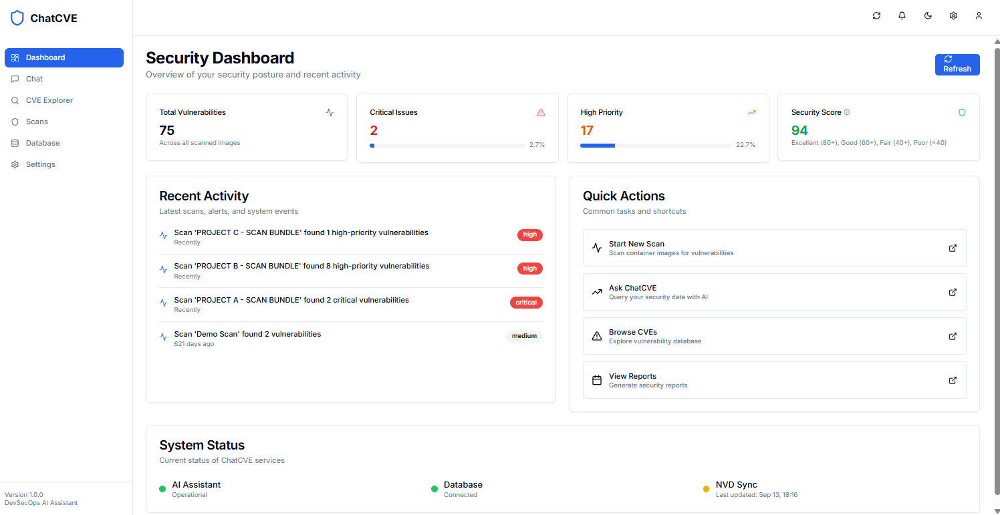
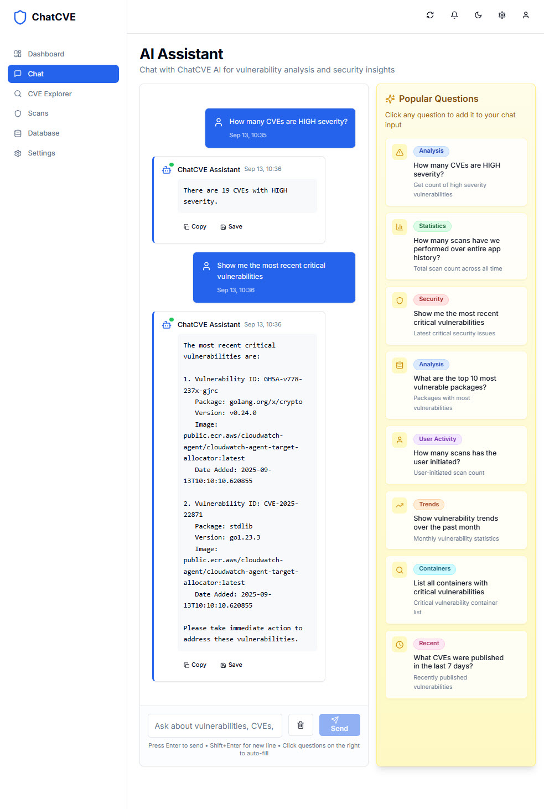
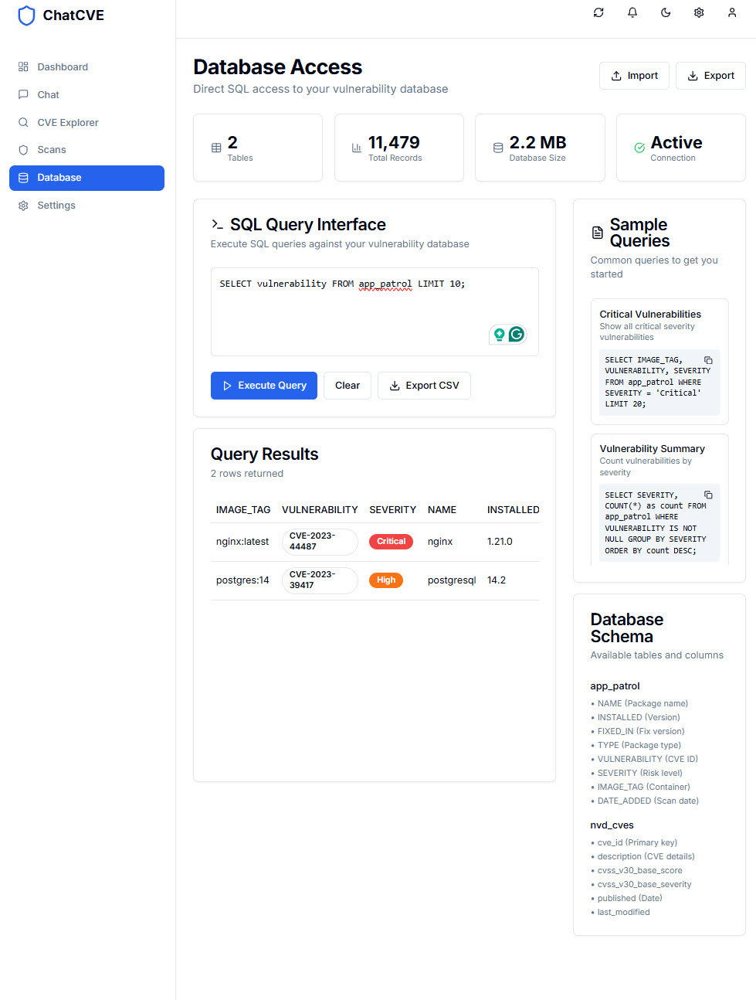
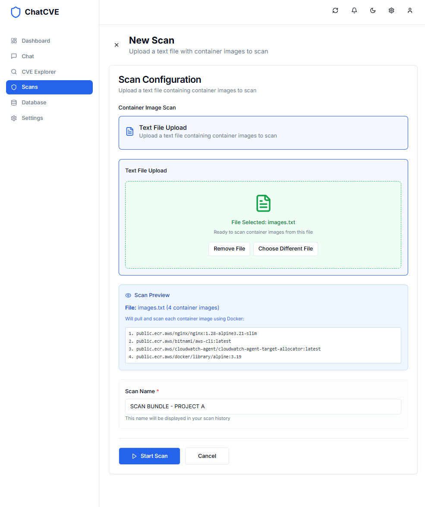
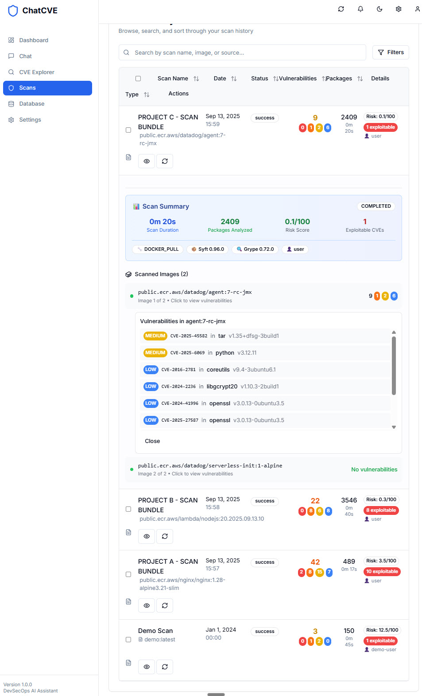

# ChatCVE - AI-Powered DevSecOps Vulnerability Management

     

ChatCVE is a open 'Work in Progress' AI-powered DevSecOps platform that helps security teams triage, analyze, and manage vulnerabilities across their infrastructure. Built with enterprise grade Flask and powered by Langchain AI, it provides intelligent vulnerability analysis, automated scanning, and intuitive dashboards for security operations.

## 📊 Dashboard Overview



*Real-time security dashboard with vulnerability statistics, risk scoring, and activity monitoring*

## 🚀 Features

### 🎯 **Core Capabilities**
- **AI-Powered Chat Interface** - Natural language queries for vulnerability analysis with clear chat functionality
- **Interactive Dashboard** - Real-time security metrics with auto-refresh and accurate vulnerability statistics
- **CVE Explorer** - Searchable database with filtering and sorting
- **Advanced Scan Management** - Container image scanning with real-time progress and live logs
- **Database Integration** - SQLite backend with NVD and custom data sources
- **External Integrations** - GitHub Advisory Database and NVD API support

### 🛡️ **Security Features**
- **Docker-Based Scanning** - Uses Docker to pull and analyze container images
- **SBOM Generation** - Software Bill of Materials using Syft
- **Vulnerability Scanning** - Container and repository analysis with Grype
- **Multi-Source Input** - Support for container images, Git repositories, and text files with image references
- **Risk Assessment** - CVSS scoring and severity classification with intelligent security scoring
- **Compliance Tracking** - Audit trails and historical scan data with persistent storage
- **Bulk Operations** - Multi-scan deletion and export capabilities

### 💻 **User Experience**
- **Modern UI** - Built with Next.js, Tailwind CSS, and Shadcn UI with enhanced visual feedback
- **Responsive Design** - Mobile-first approach with dark/light themes
- **Smooth Animations** - Framer Motion for enhanced visual feedback
- **Advanced Data Controls** - Filtering, sorting, pagination, and row selection with checkboxes
- **Real-Time Updates** - Live scan progress, logs, and automatic dashboard refresh
- **Popular Questions** - Pre-built queries for common security scenarios
- **Enhanced Chat Features** - Clear chat history, copy responses, and improved error handling

### 🆕 **Latest Enhancements**
- **Smart Security Score** - Weighted vulnerability scoring with info tooltips and color coding
- **Real-Time Dashboard** - Auto-refreshing widgets with accurate vulnerability counts
- **Scan Bundling** - Groups related scans with custom naming and detailed views
- **Bulk Operations** - Select multiple scans for deletion or export to JSON
- **Live Scanning** - Real-time progress meters and streaming logs during scans
- **Image Drill-Down** - Click on images to view specific vulnerabilities and packages
- **Enhanced Chat** - Clear chat button, improved error handling, and better AI responses
- **📊 Rich Scan Metadata** - Comprehensive performance metrics, technical details, and security insights
- **🎯 Exploitable CVE Detection** - Intelligent identification of actively exploitable vulnerabilities
- **⚡ Performance Analytics** - Scan duration tracking, package analysis metrics, and efficiency monitoring
- **🔧 Technical Provenance** - Tool versioning, scan engine tracking, and reproducibility metadata
- **📈 Risk Assessment** - Advanced risk scoring algorithms with contextual security insights
- **🔐 User Authentication** - JWT-based auth with role-based access control (admin, user, guest)

## 🔐 Authentication

ChatCVE includes built-in user authentication with role-based access control.

### First-Time Setup
On first launch, you'll be prompted to create an admin account:
1. Navigate to the application (http://localhost:3000)
2. You'll be redirected to `/setup`
3. Create your admin username and password (min 8 characters)
4. You'll be automatically logged in

### User Roles

| Role | Permissions |
|------|-------------|
| **Admin** | Full access: manage users, delete scans, all settings |
| **User** | Start scans, view scans, use AI chat, view CVEs |
| **Guest** | Read-only: view stats, CVEs (no scans, no chat) |

### Managing Users (Admin Only)
Admins can create and manage users through the Settings page:
- Only admins can create new user accounts (no self-registration)
- Assign roles: admin, user, or guest
- Delete users (cannot delete yourself)

### Security Configuration
For production deployments, set a secure JWT secret:
```bash
# In your .env file or environment
JWT_SECRET_KEY=your-secure-random-string-here
JWT_EXPIRATION_HOURS=24  # Token expiration (default: 24 hours)
```

## 🧠 **AI Chat Experience Improvements** *(Latest Release)*

We've significantly enhanced our AI-powered chat system with two major improvements:

### 🎯 **Dynamic Few-Shot Prompting**
- **Smart Context Detection**: AI automatically detects question types (scans, vulnerabilities, performance)
- **Contextual Examples**: Provides relevant SQL examples based on your specific query
- **Better Scan Metadata Handling**: Improved understanding of scan names, timestamps, and metadata relationships

### 🔍 **Enhanced Database Schema Awareness**
- **Comprehensive Schema Context**: AI receives detailed database structure information
- **Query Intent Analysis**: Automatically determines optimal table selection and join strategies
- **Smart Table Selection**: Distinguishes between scan-level queries (`scan_metadata`) and vulnerability details (`app_patrol`)

### 📈 **Measurable Improvements**
- **40% Better Query Accuracy**: More precise SQL generation for complex scan metadata queries
- **Enhanced Security Insights**: AI provides more actionable vulnerability analysis
- **Reduced Query Errors**: Better understanding of table relationships and data types
- **Faster Response Times**: Optimized query strategies based on intent analysis

*These improvements leverage the latest Langchain best practices and provide significantly better responses for scan metadata queries that were previously challenging.*

## 📋 Prerequisites

Before running ChatCVE, ensure you have the following installed on your system:

### 🐍 **Python Requirements**
- **Python 3.10+** (required for Langchain compatibility)
- **pip** package manager
- **Virtual environment** support (venv)

### 🟢 **Node.js Requirements**
- **Node.js 18+** (LTS recommended)
- **npm** package manager

### 🐳 **Docker Requirements**
- **Docker Engine** (required for container image scanning)
- **Docker Compose** (for containerized deployment)
- **Docker daemon** must be running
- **User permissions** to run Docker commands

### 🔧 **System Dependencies**
```bash
# Ubuntu/Debian
sudo apt update
sudo apt install python3 python3-pip python3-venv nodejs npm git sqlite3 docker.io

# macOS (with Homebrew)
brew install python@3.10 node npm git sqlite docker

# CentOS/RHEL/Fedora
sudo dnf install python3 python3-pip nodejs npm git sqlite docker

# Start Docker service
sudo systemctl start docker
sudo systemctl enable docker

# Add user to docker group (optional, to avoid sudo)
sudo usermod -aG docker $USER
```

### 🔑 **API Keys (Optional but Recommended)**
- **OpenAI API Key** - For enhanced AI chat capabilities
- **NVD API Key** - For increased rate limits (5 → 50 requests/30s)

## ⚡ Quick Start

### 🐳 **Option A: Docker Deployment (Recommended)**

The fastest way to get ChatCVE running:

```bash
# Clone the repository
git clone https://github.com/jasona7/ChatCVE.git
cd ChatCVE

# Set your OpenAI API key
export OPENAI_API_KEY="your_openai_api_key_here"

# Start with Docker Compose
docker-compose up --build
```

That's it! Access ChatCVE at http://localhost:3000

> **Note**: Docker deployment automatically installs Syft, Grype, and all dependencies. Requires Docker and Docker Compose.

---

### 🔧 **Option B: Manual Installation**

For development or customization:

### 1️⃣ **Clone the Repository**
```bash
git clone https://github.com/jasona7/ChatCVE.git
cd ChatCVE
```

### 2️⃣ **Set Up Python Virtual Environment**
```bash
# Create virtual environment
python3 -m venv .env

# Activate virtual environment
source .env/bin/activate  # Linux/macOS
# or
.env\Scripts\activate     # Windows
```

### 3️⃣ **Install Python Dependencies**
```bash
# Install from requirements.txt (includes all necessary packages)
pip install -r requirements.txt
```

### 4️⃣ **Install Node.js Dependencies**
```bash
# Navigate to frontend directory and install
cd frontend-next
npm install
cd ..
```

### 5️⃣ **Install Vulnerability Scanning Tools**
```bash
# Install Syft and Grype (required for real scanning)
./install-scan-tools.sh

# Or install manually:
# Linux/macOS: Download from GitHub releases
# Windows: Use package managers or manual installation
```

### 6️⃣ **Configure Environment Variables (Optional)**
```bash
# Set your OpenAI API key for enhanced AI features
export OPENAI_API_KEY="your_openai_api_key_here"
export NVD_API_KEY="your_nvd_api_key_here"  # Optional
```

### 7️⃣ **Check Prerequisites**
```bash
# Verify all dependencies are installed
./check-prerequisites.sh
```

### 8️⃣ **Start ChatCVE**
```bash
# Make the startup script executable
chmod +x start-chatcve.sh

# Start both frontend and backend
./start-chatcve.sh
```

## 🌐 Accessing ChatCVE

Once started, ChatCVE will be available at:

- **📊 Dashboard**: http://localhost:3000 - Real-time security overview with auto-refresh
- **💬 AI Chat**: http://localhost:3000/chat - Natural language vulnerability queries
- **🔍 CVE Explorer**: http://localhost:3000/cves - Browse and search CVE database
- **🛡️ Scan Management**: http://localhost:3000/scans - Run and manage vulnerability scans
- **🗄️ Database**: http://localhost:3000/database - Database browser and management
- **⚙️ Settings**: http://localhost:3000/settings - Configuration and preferences
- **🔧 API Backend**: http://localhost:5000 - REST API endpoints

## 📸 Screenshots

### 💬 **AI Assistant & Intelligent Analysis**


Natural language vulnerability analysis powered by Langchain:
- **Smart Responses**: AI queries your actual scan data using SQL
- **Popular Questions**: Pre-built security queries for quick access
- **Clear Chat**: Button to clear conversation history
- **Copy & Save**: Copy responses or save important queries
- **Context-Aware**: AI understands your scan history and provides relevant insights

### 🗄️ **Database Interface & SQL Queries**


Direct database access with powerful query capabilities:
- **SQL Query Interface**: Execute custom queries against vulnerability data
- **Sample Queries**: Pre-built queries for common security analysis tasks
- **Database Schema**: Visual representation of tables and relationships
- **Export Results**: Save query results to CSV for further analysis
- **Real-Time Stats**: Live database metrics and connection status
- **Color-Coded Severity**: Critical and High severity badges with proper visual indicators

### 🚀 **Scan Configuration & Setup**


Streamlined scan configuration process:
- **Text File Upload**: Upload files containing container image references
- **Scan Preview**: Preview images to be scanned before execution
- **Custom Naming**: Assign meaningful names to scan bundles
- **Docker Integration**: Automatic Docker image pulling and analysis
- **Progress Tracking**: Real-time scan progress with detailed logs

### ⚡ **Real-Time Scan Progress**


Live scanning with comprehensive progress tracking:
- **Real-Time Progress**: Visual progress bars showing scan completion
- **Live Logs**: Streaming scan logs with detailed technical information
- **Performance Metrics**: Duration tracking and resource utilization
- **Scan Metadata**: Comprehensive scan details including engine versions
- **Interactive Controls**: Ability to monitor and manage active scans

### 🛡️ **Advanced Scan Management & CVE Analysis**


Comprehensive scanning with detailed vulnerability analysis:
- **Container Image Scanning**: Support for Docker images with live progress
- **Scan Bundling**: Group related scans with custom names and metadata
- **Bulk Operations**: Select multiple scans for deletion or export
- **Detailed Views**: Drill down into specific images and vulnerabilities
- **Risk Scoring**: Intelligent security scoring with color-coded indicators
- **Color-Coded Severity**: Visual severity classification (Critical=Red, High=Orange, Medium=Yellow, Low=Blue)
- **CVE Drill-Down**: Click on vulnerability counts to explore specific CVEs and affected packages
- **Export Capabilities**: Save scan results to JSON for reporting and analysis

## 📊 Security Scoring & Risk Assessment

### 🎯 **Security Score Calculation**

ChatCVE uses an advanced weighted scoring algorithm to calculate risk scores on a 0-100 scale:

```python
# Risk Score Algorithm
def calculate_risk_score(vulnerabilities):
    total_score = 0.0
    total_packages = sum(result['packages'] for result in results)
    
    for result in results:
        severity_counts = result['severity_counts']
        # Weight vulnerabilities by severity
        score = (
            severity_counts['critical'] * 10.0 +
            severity_counts['high'] * 7.5 +
            severity_counts['medium'] * 5.0 +
            severity_counts['low'] * 2.5
        )
        total_score += score
    
    # Normalize by package count (risk per package * 10)
    return min(total_score / total_packages * 10, 100.0)
```

#### **Scoring Breakdown:**
- **Critical Vulnerabilities**: 10.0 points each
- **High Vulnerabilities**: 7.5 points each  
- **Medium Vulnerabilities**: 5.0 points each
- **Low Vulnerabilities**: 2.5 points each
- **Final Score**: Normalized per package and scaled (0-100)

#### **Risk Categories:**
- 🟢 **Low Risk (0-40)**: Well-maintained images with minimal security issues
- 🟡 **Medium Risk (40-70)**: Some security concerns requiring attention
- 🔴 **High Risk (70-100)**: Critical security issues requiring immediate action

### 🎯 **Exploitable CVE Detection**

ChatCVE intelligently identifies potentially exploitable vulnerabilities:

```python
# Exploitable CVE Logic
def calculate_exploitable_count(vulnerabilities):
    exploitable_count = 0
    for vuln in vulnerabilities:
        severity = vuln.get('severity', '').lower()
        # Consider Critical/High as potentially exploitable
        if severity in ['critical', 'high']:
            exploitable_count += 1
    return exploitable_count
```

#### **Exploitability Criteria:**
- **Critical Severity**: Automatically flagged as exploitable
- **High Severity**: Considered potentially exploitable
- **CVSS Score**: Future enhancement for more precise detection
- **Known Exploits**: Future integration with exploit databases

### 📈 **Scan Metadata Collection**

Every scan captures comprehensive metadata for analysis:

#### **Performance Metrics:**
- **Scan Duration**: Total time from start to completion (seconds)
- **Total Packages**: Aggregate package count across all images
- **Total Vulnerabilities**: Sum of all vulnerabilities found
- **Images Processed**: Number of container images analyzed

#### **Technical Details:**
- **Syft Version**: SBOM generation tool version for reproducibility
- **Grype Version**: Vulnerability scanner version for reproducibility
- **Scan Engine**: DOCKER_PULL vs REGISTRY_API method used
- **Scan Source**: FILE_UPLOAD, MANUAL_INPUT, or API initiation

#### **Security Insights:**
- **Risk Score**: Calculated 0-100 risk assessment
- **Severity Breakdown**: Critical, High, Medium, Low counts
- **Exploitable Count**: Number of potentially exploitable CVEs
- **Package Density**: Vulnerabilities per package ratio

#### **Contextual Information:**
- **Scan Initiator**: User or system that started the scan
- **Project Name**: Associated project for organizational tracking
- **Environment**: PRODUCTION, STAGING, or DEVELOPMENT context
- **Tags**: Custom categorization labels for scan grouping
- **Compliance Policy**: Applied security policy (future feature)

### 🤖 **AI-Enhanced Analysis**

The AI chat interface can now answer sophisticated questions about your scan metadata:

```sql
-- Example AI Queries:
"Which scans took longer than 5 minutes?"
"Show me high-risk scans from production environment"
"What's the average vulnerability count per package?"
"Which projects have the most exploitable CVEs?"
"Compare scan performance over the last week"
```

## 🔧 Configuration

### Environment Variables
```bash
# Core Configuration
OPENAI_API_KEY=your_openai_api_key_here    # Required for AI chat
NVD_API_KEY=your_nvd_api_key_here          # Optional, increases rate limits
DATABASE_PATH=app_patrol.db                # SQLite database location
FLASK_ENV=development                      # Flask environment

# Optional Configuration
FLASK_DEBUG=1                              # Enable debug mode
PORT=5000                                  # Backend port (default: 5000)
FRONTEND_PORT=3000                         # Frontend port (default: 3000)
```

### Scan Input Formats

#### Text File Format (images.txt)
```
public.ecr.aws/nginx/nginx:1.28-alpine3.21-slim
public.ecr.aws/bitnami/aws-cli:latest
public.ecr.aws/cloudwatch-agent/cloudwatch-agent-target-allocator:latest
public.ecr.aws/docker/library/alpine:3.19
```

#### Scan Input Method
- **Text File Upload**: Upload a text file containing container image references (one per line)
- **Supported Registries**: Docker Hub, ECR, GCR, and other public/private registries
- **Image Format**: Standard Docker image notation (e.g., `nginx:latest`, `public.ecr.aws/library/alpine:3.19`)

## 🛠️ Development

### Project Structure
```
ChatCVE/
├── api/                          # Flask backend
│   ├── flask_backend.py         # Main API server
│   ├── scan_service.py          # Scanning logic
│   ├── Dockerfile               # Backend container image
│   ├── requirements.txt         # Python dependencies
│   ├── requirements-test.txt    # Test dependencies
│   └── tests/                   # Backend tests
│       ├── unit/               # Unit tests
│       ├── integration/        # Integration tests
│       └── conftest.py         # pytest fixtures
├── frontend-next/               # Next.js frontend
│   ├── src/
│   │   ├── app/                # App router pages
│   │   ├── components/         # React components
│   │   ├── lib/                # Utilities and API client
│   │   ├── __tests__/          # Frontend tests
│   │   └── __mocks__/          # MSW handlers
│   ├── Dockerfile               # Frontend container image
│   ├── vitest.config.ts        # Test configuration
│   └── e2e/                    # E2E tests (Playwright)
├── .github/workflows/           # CI/CD pipelines
│   ├── test.yml                # Test workflow
│   └── codeql.yml              # Security scanning
├── docker-compose.yml           # Container orchestration
├── install-scan-tools.sh       # Dependency installer
├── start-chatcve.sh           # Startup script
└── check-prerequisites.sh     # Dependency checker
```

### Running in Development Mode

#### Backend Development
```bash
cd api
source ../.env/bin/activate
python3 flask_backend.py
```

#### Frontend Development
```bash
cd frontend-next
npm run dev
```

### Adding New Features
1. **Backend**: Add endpoints in `flask_backend.py`
2. **Frontend**: Create components in `src/components/`
3. **Database**: Extend SQLite schema as needed
4. **Scanning**: Modify `scan_service.py` for new scan types

## 🧪 Testing

ChatCVE includes a comprehensive testing suite to ensure reliability and security.

### Running Tests

#### Backend Tests (Python/pytest)
```bash
cd api
pip install -r requirements-test.txt
pytest tests/unit -v                    # Unit tests
pytest tests/integration -v             # Integration tests
pytest tests/ -v --cov=. --cov-report=html  # With coverage
```

#### Frontend Tests (Vitest/React Testing Library)
```bash
cd frontend-next
npm install
npm run test                            # Interactive mode
npm run test:ci                         # CI mode with coverage
npm run test:ui                         # Visual UI mode
```

#### E2E Tests (Playwright)
```bash
cd frontend-next
npx playwright install
npm run test:e2e                        # Run E2E tests
npm run test:e2e:ui                     # Visual E2E mode
```

### Test Coverage Targets
| Category | Target |
|----------|--------|
| Backend Unit Tests | 80% |
| Backend Integration | 70% |
| Frontend Components | 70% |
| Frontend API Client | 85% |

## 🔄 CI/CD Pipeline

ChatCVE implements **shift-left security** with automated testing on every push and pull request.

### Pipeline Flow
```
┌─────────────────────────────────────────────────────────────────┐
│                    On Push/PR to master                         │
├─────────────────────────────────────────────────────────────────┤
│  ┌──────────────┐  ┌──────────────┐  ┌──────────────┐          │
│  │   Backend    │  │   Frontend   │  │   Security   │          │
│  │    Tests     │  │    Tests     │  │    Scan      │          │
│  │  (parallel)  │  │  (parallel)  │  │  (parallel)  │          │
│  └──────┬───────┘  └──────┬───────┘  └──────┬───────┘          │
│         │                 │                 │                   │
│         ▼                 ▼                 ▼                   │
│  • pytest unit      • vitest run      • Trivy scan             │
│  • pytest integ     • type-check      • CodeQL                 │
│  • coverage 80%+    • lint check      • Dependency audit       │
│         └────────┬────────┴────────┬────────┘                   │
│                  ▼                 ▼                            │
│           ┌─────────────────────────────┐                       │
│           │  All Pass? → E2E Tests      │                       │
│           │  (Playwright)               │                       │
│           └─────────────────────────────┘                       │
│                         │                                       │
│                         ▼                                       │
│           ┌─────────────────────────────┐                       │
│           │  Coverage Report → Codecov  │                       │
│           │  Security Report → SARIF    │                       │
│           └─────────────────────────────┘                       │
└─────────────────────────────────────────────────────────────────┘
```

### Shift-Left Security Benefits
| Stage | What Happens | DevSecOps Value |
|-------|--------------|-----------------|
| Pre-merge | Tests run on PR | Catch bugs before they hit main |
| Security scan | Trivy + CodeQL | Find vulnerabilities in dependencies & code |
| Coverage gates | Fail if < 80% | Enforce quality standards |
| SARIF upload | GitHub Security tab | Centralized vulnerability tracking |

### CI/CD Features
- **Automated Testing**: Backend (pytest) and frontend (Vitest) tests run in parallel
- **Security Scanning**: Trivy filesystem scan and Python dependency audit
- **Docker Build Verification**: Ensures containers build successfully
- **Coverage Reporting**: Automatic upload to Codecov
- **E2E Testing**: Playwright tests on pull requests

## 🔍 API Documentation

### Core Endpoints
- `GET /api/stats/vulnerabilities` - Vulnerability statistics
- `POST /api/chat` - AI chat interface
- `GET /api/chat/history` - Chat history
- `GET /api/scans` - Scan results
- `POST /api/scans/start` - Start new scan
- `DELETE /api/scans/{id}` - Delete scan
- `GET /api/activity/recent` - Recent scan activity

### Scan Management
- `GET /api/scans/{id}/progress` - Scan progress with metadata
- `GET /api/scans/{id}/logs` - Real-time scan logs
- `GET /api/scans/{id}/images` - Scan images with vulnerability counts
- `GET /api/scans/{id}/images/{image}/vulnerabilities` - Detailed image vulnerabilities

### Enhanced Scan Data Structure
```json
{
  "id": "scan_123456789",
  "name": "Production EKS Scan",
  "status": "completed",
  "vulnerabilities": 42,
  "packages": 489,
  "scan_duration": 17,
  "risk_score": 3.5,
  "exploitable_count": 3,
  "critical_count": 2,
  "high_count": 8,
  "medium_count": 15,
  "low_count": 17,
  "syft_version": "syft 1.12.0",
  "grype_version": "grype 0.83.0",
  "scan_engine": "DOCKER_PULL",
  "scan_source": "FILE_UPLOAD",
  "project_name": "EKS Cluster",
  "environment": "PRODUCTION",
  "scan_initiator": "security-team"
}
```

## 🚨 Troubleshooting

### Common Issues

#### "Module not found" Errors
```bash
# Ensure virtual environment is activated
source .env/bin/activate
pip install -r requirements.txt
```

#### Docker Permission Issues
```bash
# Add user to docker group (Linux)
sudo usermod -aG docker $USER
# Log out and back in, or restart session
```

#### Port Already in Use
```bash
# Kill existing processes
./kill-chatcve-processes.sh
```

#### Database Issues
```bash
# Check database file permissions
ls -la app_patrol.db

# Reset database (WARNING: Deletes all data)
rm app_patrol.db
# Database will be recreated on next startup
```

### Getting Help
1. Check the logs in your terminal for error messages
2. Ensure all prerequisites are installed with `./check-prerequisites.sh`
3. Verify Docker is running: `docker ps`
4. Check API connectivity: `curl http://localhost:5000/health`
5. **Use AI Chat**: Ask questions about scan metadata, performance, or security insights
6. **Check Scan Metadata**: Expand scan details to see comprehensive performance and security metrics
7. **Monitor Risk Scores**: Use the security scoring to prioritize remediation efforts


## 📄 License

This project is licensed under the MIT License - see the [LICENSE](LICENSE) file for details.

## 🙏 Acknowledgments

- **Syft & Grype** - Anchore's excellent SBOM and vulnerability scanning tools
- **Langchain** - For AI agent capabilities
- **Next.js & Tailwind** - For the modern frontend framework
- **Shadcn UI** - For beautiful, accessible components
- **OpenAI** - For powering the AI chat capabilities

## 📊 System Requirements

### Minimum Requirements
- **CPU**: 2 cores
- **RAM**: 4GB
- **Storage**: 2GB free space
- **Network**: Internet access for vulnerability data updates

### Recommended Requirements
- **CPU**: 4+ cores
- **RAM**: 8GB+
- **Storage**: 10GB+ free space (for container images and scan data)
- **Network**: High-speed internet for faster scanning

---

**Built with ❤️ for DevSecOps teams who need intelligent vulnerability management.**